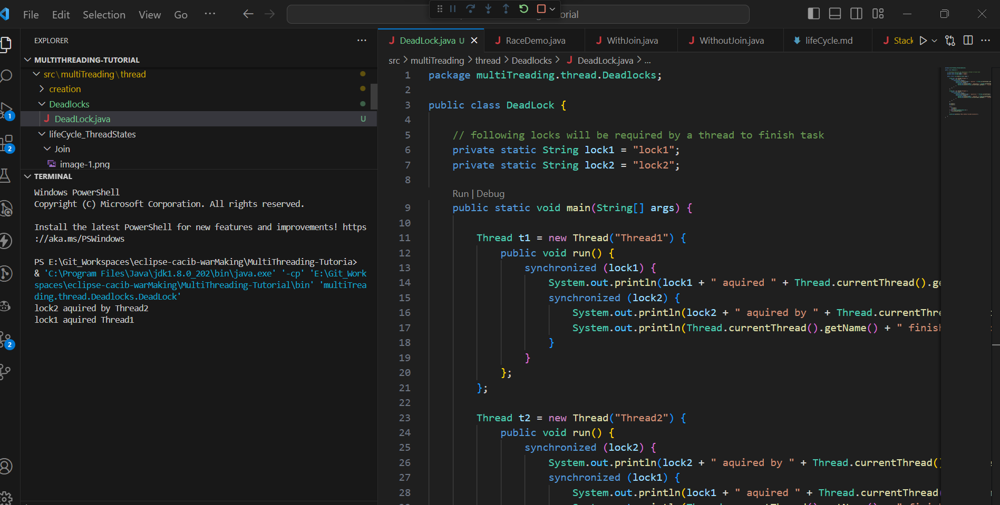

#Deadlock

<b>Deadlock</b> can occur in a situation when a thread is waiting for an object lock, that is acquired by another thread and second thread is waiting for an object lock that is acquired by first thread. Since, both threads are waiting for each other to release the lock, the condition is called deadlock.

## How to Avoid Deadlock in Java?

Deadlocks cannot be completely resolved. However, they can be avoided by following some basic rules:

1. **Avoid Nested Locks:**
   - We must avoid giving locks to multiple threads, as this is the main reason for a deadlock condition. Deadlocks often occur when locks are acquired in a nested manner by multiple threads.

2. **Avoid Unnecessary Locks:**
   - Locks should be given only to the necessary threads. Avoid giving locks to threads that are not essential for the current operation, as this may lead to a deadlock condition.

3. **Using Thread Join:**
   - A deadlock usually happens when one thread is waiting for another to finish. In such cases, the `join` method can be used with a maximum waiting time for a thread to complete its execution. This helps prevent indefinite waiting and potential deadlock situations.

These guidelines aim to reduce the likelihood of deadlocks in Java programs. It's important to carefully design and manage the acquisition and release of locks to minimize the chances of encountering deadlock scenarios.

- In our case main thread will neve finish execution because thread 1 and thread 2 are holding on locks which are required for other threads excecution causing deadlock
    - this can be avoided and prevented by letting threads <b>aquire locks sequintially</b>
    - 