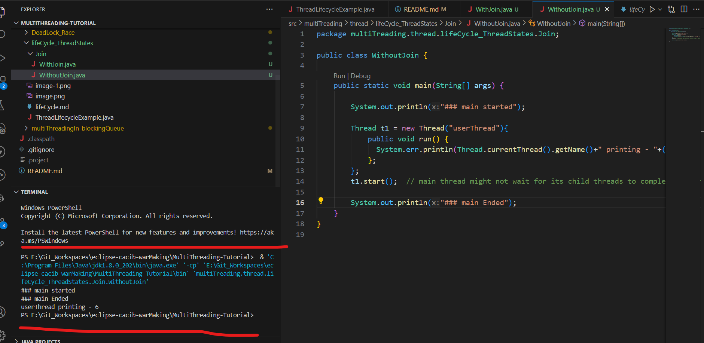
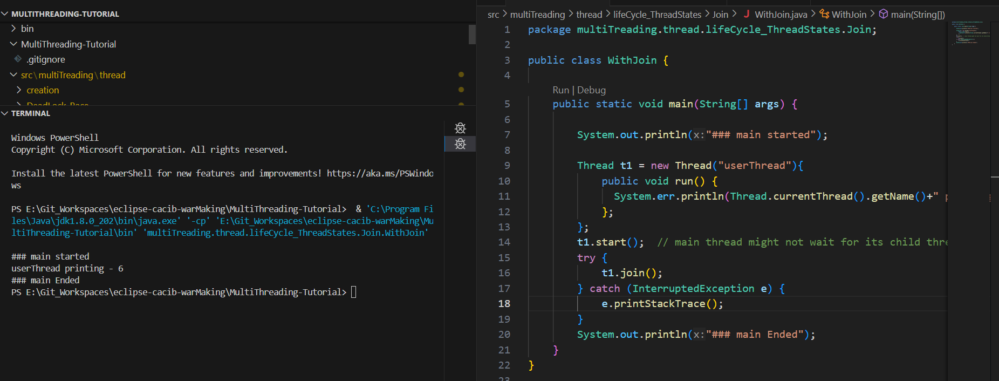

##Join

### Join put Threads in TIMED_WAIT state who excecution is done until other threads are finished executing

- without calling join main finish execution first
  - 
- with join main waited for user thread to finish execution 
   - 